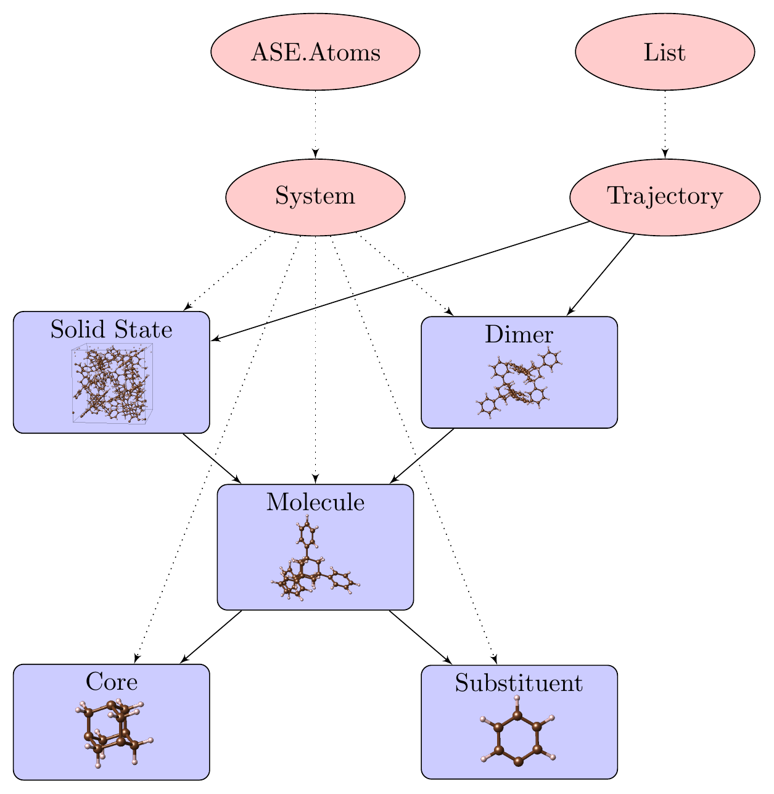

System package
==============

This module keeps all the different classes of the module and is the most important part of the module. The
structure and inherits of the classes are shown in the figure below.

.. note::
   Dotted line: inherits from

   Solid line: contains objects of type () as attributes, either in a list or just one instance.

   Example: the Solid State class contains multiple molecules (solid.molecules), which contains a core structure (solid.molecules[0].core)
   and substituents (solid.molecules[0].substituents). This heritance of structures has proven to be very useful. It is applied by the *analysis* or
   *matchPattern* functions of each object.

.. toctree::
   :maxdepth: 1

   ClusterMaestro.System.Structure
   ClusterMaestro.System.Atom
   ClusterMaestro.System.Core
   ClusterMaestro.System.Substituent
   ClusterMaestro.System.Molecule
   ClusterMaestro.System.Oligomer
   ClusterMaestro.System.Solid
   ClusterMaestro.System.Trajectory

.. automodule:: ClusterMaestro.System
   :members:
   :undoc-members:
   :show-inheritance:

